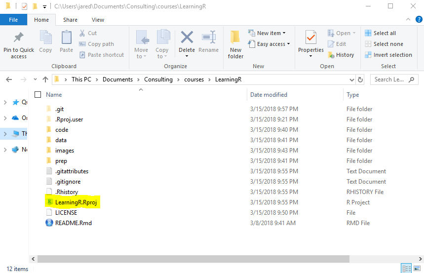
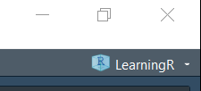

<!-- README.md is generated from README.Rmd. Please edit that file -->

# ODSC East 2019 Workshop

This is an empty repo to initialize an R project for training courses
organized by [ODSC](https://odsc.com/boston/schedule-overview-2019).

# Packages

To get started run the following code to install the latest version of
the necessary packages.

<div class="sourceCode">

<pre class='sourceCode r'><code class='sourceCode r'>
packages <- c(
    'coefplot', 
    'DiagrammeR', 
    'ggthemes', 
    'glmnet', 
    'here', 
    'leaflet', 
    'rmarkdown', 
    'rprojroot', 
    'threejs', 
    'tidymodels', 
    'tidyverse', 
    'usethis', 
    'UsingR', 
    'xgboost'
)
install.packages(packages)
</code></pre>

</div>

# Project Structure

Making use of RStudio projects greatly improves the user experience. To
facilitate this users should run the following code which will recreate
this project on their computer. Be sure to select the positive prompts
such as `yes`, `yeah`, etc.

``` r
newProject <- usethis::use_course('https://github.com/jaredlander/odsceast2019/archive/master.zip')
```

<!-- After that runs successfully you will have a new folder holding the R project that looks like this (the name in the image may be different). -->

<!-- ```{r proj-folder,echo=FALSE} -->

<!--  -->

<!-- ``` -->

If a new project **did not open** automatically, run the following line
of code.

``` r
rstudioapi::openProject(newProject)
```

After running this code, you will be in an RStudio Project called
odsceast2019. You can see this in the top right of RStudio.

<!-- -->

## Clone this Repo

Alternatively, if you use git then please clone this repo then open it
as an [RStudio
Project](https://support.rstudio.com/hc/en-us/articles/200526207-Using-Projects).

Skip this step if you followed the instructions above.

``` sh
# if using SSH
git clone git@github.com:jaredlander/odsceast2019.git

# if using https
git clone https://github.com/jaredlander/odsceast2019.git
```

# Data

Data for the class is kept at
[data.world](https://data.world/landeranalytics/training). You can sign
up for a free account or run the following code. This requires that you
are using an [RStudio
Project](https://support.rstudio.com/hc/en-us/articles/200526207-Using-Projects)
setup exactly like this repo, which is done if you followed the
preceding code.

``` r
source('prep/DownloadData.r')
```
